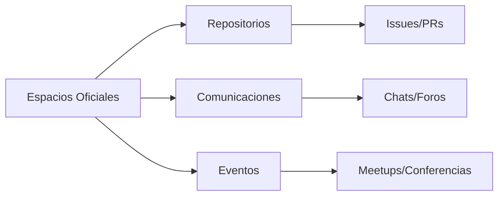

# Código de Conducta de NodoCentral 

## 1. Nuestra Promesa

Nos comprometemos a mantener una comunidad inclusiva y libre de acoso para todos, sin distinción de:

- Edad, dimensión corporal, discapacidad (visible o invisible)
- Etnicidad, características sexuales, identidad y expresión de género
- Nivel de experiencia, educación, condición socioeconómica
- Nacionalidad, apariencia, raza, religión u orientación sexual

## 2. Estándares de la Comunidad

### 2.1 Comportamiento Esperado

| Categoría | Ejemplos |
|-----------|----------|
| **Respeto** | Escuchar activamente, considerar diferentes perspectivas |
| **Empatía** | Apoyar a miembros nuevos, comprender contextos diversos |
| **Profesionalismo** | Comunicación clara, retroalimentación constructiva |
| **Colaboración** | Trabajo en equipo, reconocimiento de contribuciones |
| **Inclusión** | Lenguaje neutral, adaptación a necesidades diversas |

### 2.2 Comportamiento Inaceptable

| Tipo | Descripción |
|------|-------------|
| **Acoso** | Comentarios sexuales, intimidación, seguimiento |
| **Discriminación** | Lenguaje ofensivo, estereotipos, exclusiones |
| **Disrupción** | Spam, interrupciones constantes, off-topic |
| **Fraude** | Suplantación, múltiples cuentas, plagio |
| **Inseguridad** | Compartir información privada sin consentimiento |

## 3. Implementación

### 3.1 Proceso de Reporte

1. **Canales**:
   - Discord: [Enlace al servidor]
   - Formulario anónimo
   - Email: conducta@codeverse.org

2. **Requisitos del Reporte**:
   - Información del incidente (fecha, contexto)
   - Personas involucradas
   - Evidencia disponible (capturas, logs)

### 3.2 Escala de Sanciones

| Nivel | Infracción | Consecuencia |
|-------|------------|--------------|
| **1** | Primera ofensa menor | Advertencia privada |
| **2** | Reincidencia | Suspensión temporal (7-30 días) |
| **3** | Violación grave | Suspensión prolongada (1-12 meses) |
| **4** | Patrón sistemático | Expulsión permanente |

### 3.3 Confidencialidad

- Todos los reportes se manejan con discreción
- Solo comparten información los moderadores necesarios
- Se protege la identidad de reporteros anónimos

## 4. Alcance

Aplica en:

## 5. Referencias

- Basado en [Contributor Covenant 2.0](https://www.contributor-covenant.org)
- Inspirado en los estándares de:
  - Mozilla Community Guidelines
  - Python Community Code of Conduct
  - Ubuntu Code of Conduct

## 6. Contacto

**Comité de Conducta**:

---

**Versión**: 2.1  
**Última actualización**: Enero 2025  
**Idiomas disponibles**: Español, English, Français, Deutsch  
**Licencia**: CC BY 4.0